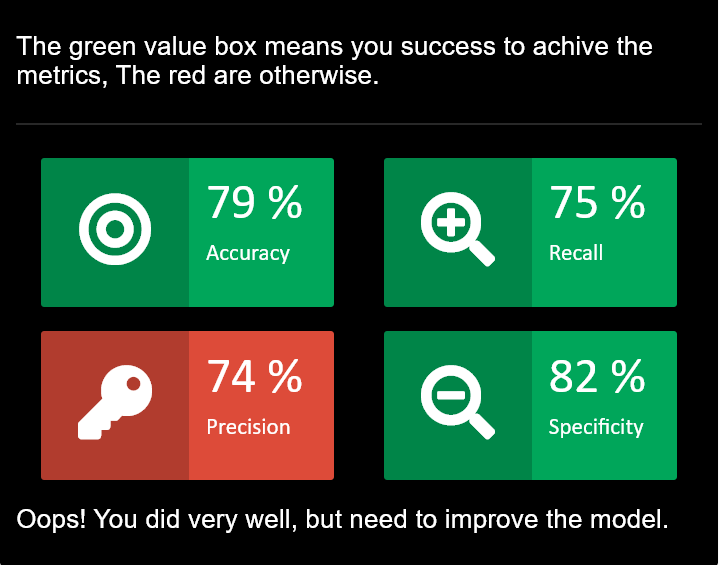

```{r setup, echo=FALSE, cache=FALSE, fig.width=5, fig.width=5}
library(knitr)
library(rmdformats)

## Global options
options(max.print="125")
set.seed(16)
options(scipen = 999)
opts_chunk$set(echo=TRUE,
	             cache=TRUE,
               prompt=FALSE,
               tidy=TRUE,
               comment=NA,
               message=FALSE,
               warning=FALSE)
opts_knit$set(width=75)
```

# Introduction {.tabset .tabset-fade .tabset-pills}

Flight is number one choices of travelling transportation nowadays. It serves in comfort, speed, and long-distance trip. However, any positives usually followed by some disadvantages. Some cases in flights would hamper our journey, especially the most common one, **flight delay**. Here we will try to put up some machine learning in action, to predict whether the flight is more likely to be postponed or not.

## Data Explanation

The dataset here contains all flights from Newark Liberty International Airport to Charlotte Douglas International Airport in 2013, including some variables like the scheduled time, departure delay, carrier, etc. Also another dataset of weather condition in 2013 recorded per hour, containing informations like wind speed, wind gust, humidity, etc.

## Business Case

Customers prefer to choose flight with less delay, or if the delay is unavoidable, they were notified first. By making a machine learning model to predict whether a flight should be delayed or not, we can reduce the number of "sudden delay" and give more satisfaction to our customers, which would probably attract more customers to choose our airline.

## Load Library and Data

Here I will use bunch of libraries, all including libraries for data wrangling and building machine learning model (also evaluation). The data I will use will be stored in two objects named `flight` for flight information and `weather` for weather information.

```{r message=FALSE}
library(dplyr) # Data wrangling
library(lubridate) # Dealing with datetime
library(ggplot2) # Visualization
library(caret) # Model pre-processing
library(keras) # Neural Network Model
library(randomForest) # Random Forest Model
library(MLmetrics) # Model Evaluation
library(lime) # Model interpretation
```

```{r}
flight <- read.csv("data-train-flight.csv")
weather <- read.csv("data-train-weather.csv")
```

# Data Wrangling {.tabset .tabset-fade .tabset-pills}

## `Flight` Table

**1. First we need to handle missing values**  

```{r}
colSums(is.na(flight))
```

```{r}
table(is.na(flight))
prop.table(table(is.na(flight)))*100
```

In total, there are 390 missing values from 78438 observations, or just $\pm$ 0.5%. Technically, we can omit these rows.
```{r}
flight_set <- na.omit(flight)
```

Re-check it again
```{r}
colSums(is.na(flight_set))
```

**2. Delete Non-Informative Variable**

Let's take another glance on our flight dataset.  

```{r}
head(flight_set)
```

Prior to make a machine learning model, there are several columns that is considered non-informative   

- Columns that only has one level, such as `year` that only has *2013* as its observations. These columns would do nothing to our model. This is also the case for `origin`, `dest`, and `distance` variable, which only have *EWR*, *CLT*, and *529*, respectively.  

- In contrast, is columns with too many levels, usually character-type. Unless we are doing visualization, or making an NLP model, these observations would less likely to be useful. In this table, those are variables like `tailnum` and `flight`.  

- I find out that the `time_hour` variable has no information left in it since the day and month have already been extracted. We can delete this column as well.  

```{r}
table(flight_set$carrier, flight_set$arr_delay)
```

- There are 3 different carriers, but *UA* has only two flights the last 11 months, so we can assume that this is a rare observations and wouldn't do much to our model. Also the `delay` on the other two flights are near to equal, so it wouldn't give much improvement to our model. This means, we can remove this column.

```{r}
flight_set %>% select(-year,-carrier,-flight, -tailnum, -origin, -dest, -distance, -time_hour)-> flight_fix
```

**3. Feature Extraction**  

This functions will convert the integer time into a vector length 2 containing `hour` and `minute` in character format. For instance, if the **sched_arr_time** is `613`, this function will return it as `"6"` and `"13"`.  

```{r}
apply_split <- function(data){
  
  time_split <- function(time){
    if (nchar(time)==3){
      hour_time <- substr(time,1,1)
      minute_time <- substr(time,2,3)
    } else {
      hour_time <- substr(time,1,2)
      minute_time <- substr(time,3,4)
    }
    return(c(hour_time,minute_time))
  }
  
  temp <- sapply(data, time_split)
  return(t(temp))
}
```

Main feature extraction for this case is, converting `sched_arr_time` variable, which is in integer type, into character, using function I provided above. Our expected final output is the scheduled duration of the flight, based on the scheduled arrived time substracted with scheduled departure. While the information we need from `dep_time` is just `dep_delay`, so we don't need this column anymore. Also the hour and minute in this table, was extracted from  `sched_dep_time` column.  

```{r}
flight_fix %>% 
  mutate(hour_sched_arr = apply_split(sched_arr_time)[,1]) %>% 
  mutate(minute_sched_arr = apply_split(sched_arr_time)[,2]) %>% 
  mutate(sched_dep = paste(hour,":",minute,sep = "")) %>% 
  mutate(sched_arr = paste(hour_sched_arr,":",minute_sched_arr,sep = "")) %>% 
  mutate(duration = hm(sched_arr)-hm(sched_dep)) %>% 
  select(-dep_time, -sched_dep_time, -sched_arr_time,-hour_sched_arr, -minute_sched_arr, -sched_arr, -sched_dep, -minute) %>% 
  mutate(duration = hour(duration)*60 + minute(duration)) %>% 
  select(month,day,hour,dep_delay,duration, arr_delay)-> flight_final
```

```{r}
head(flight_final)
```

Now we have all variables we needed for building a machine learning model, here some explanations for table above :  

- `month`, `day`, `hour` all will be used to join with `weather table`  
- `dep_delay` and `duration` will be the predictors for machine learning model.  
- `arr_delay` is our target variable

## `Weather` Table

**1. First we need to handle missing values**  

```{r}
colSums(is.na(weather))
```

```{r}
nrow(weather)
```

`wind_gust` variable has an extreme **NA**. With 6270 missing values from only 7989 observations, or $\pm$ 78.5%. Variable `pressure` also has $\pm$ 10% of missing values. These two will do nothing to our model, so we can remove them.

```{r}
weather_set <- select(weather,-wind_gust, -pressure)
```

Re-check it again
```{r}
colSums(is.na(weather_set))
table(is.na(weather_set))
prop.table(table(is.na(weather_set)))*100
```

With only 0.26% missing values, we can technically delete these observations. But, doing so would do more harm on our future analysis, since the data is time-series lookalike data (a data with regular time-setting), thus, an imputation is better for this one. Let's look closely at the `wind_speed` variable

```{r}
summary(weather_set$wind_speed)
```

The gap betwenn the 3rd quartile and the maximum value is very large. This shows that outlier exists in this variable and thus it's better to use **median imputation**

```{r}
medImp <- preProcess(weather_set, "medianImpute")
weather_set <- predict(medImp, weather_set)
```

Re-check it again
```{r}
colSums(is.na(weather_set))
```

**2. Delete Non-Informative Variable**

Since all of the variables are numeric, we can do feature selection by looking at the summary. Variables with either low range, low-level, or near zero variance can be omitted.  

```{r}
summary(weather_set)
```

- `year` only has one level, we can delete it then.  
- `time_hour` gives us no information since the day and month have already been extracted. We can remove this column as well. 

```{r}
weather_set %>% select(-year,-time_hour) -> weather_fix
```

Now let's see which variable has a variance relatively close to 0

```{r}
predVar <- vector()
for (i in 1:ncol(weather_fix)){
  predVar[i] <- round(var(weather_fix[,i]),4)
}
```

```{r}
data.frame(Variable = colnames(weather_fix), Variance = predVar)
```

As we can see, `precip` variable has a variance near to zero, while `visib` is not near to zero, but compared to other variable, the variance is relatively low, and can be defined as **near-zero**, so we can remove these two variables.

```{r}
weather_final <- select(weather_fix, c(-precip,-visib))
```

Finally we have this table
```{r}
head(weather_final)
```

## Join Table

After tidying both tables, we can join them using the `left_join()` function from `dplyr`. Three columns that intersect both table are `month`, `day` and `hour`.  

```{r}
flight_final %>% 
  left_join(weather_final, by = c("month","day","hour")) -> airline
head(airline)
```

It seems like we stumble with another missing values.

```{r}
colSums(is.na(airline))
table(is.na(airline))
prop.table(table(is.na(airline)))
```

60 from total observations, or just about $\pm$ 0.12%, and all came from the same 12 flight observations. So I think it wouldn't be a problem if we remove these rows. 

```{r}
airline <- na.omit(airline)
```

As I recall, we only use `month`, `day`, and `hour` to cross/intersect our **flight** and **weather** table, while the information we needed from those three variables are all represented by the variables in **weather** table, so it is safe to remove these columns.

```{r}
airline %>% select(-month,-day,-hour) -> airline
```

I'll also reorder the columns by shifting the target variable `arr_delay` to the right corner, just to tidy up a little bit.  

```{r}
airline %>% select(1:2,4:8,arr_delay) -> airline
```

Now here is the table we'll be working on to find the best machine learning model for prediction

```{r}
head(airline)
```

# Exploratory Data Analysis

```{r include=FALSE}
theme_airline <- theme(
           panel.background = element_rect(fill="#6CADDF"),
           panel.border = element_rect(fill=NA),
           panel.grid.minor.x = element_blank(),
           panel.grid.major.x = element_blank(),
           panel.grid.major.y = element_blank(),
           panel.grid.minor.y = element_blank(),
           plot.background = element_rect(fill="#00285E"),
           text = element_text(color="white"),
           axis.text = element_text(color="white")
           )
```

Before we get into model fitting, let's explore our data a little bit to see whether we need another pre-processing or not.  

**1. Which carrier has the highest number of delay?**

```{r}
flight_set %>% 
  group_by(carrier,arr_delay) %>% 
  count() -> airViz1
airViz1
```

```{r fig.width=8,fig.height = 3}
ggplot(airViz1, aes(x = carrier, y = n)) + geom_col(aes(fill = arr_delay),position = "dodge") + coord_flip() + 
  scale_fill_manual(values = c("darkred","dodgerblue4")) + 
  labs(title = "Flights Delayed per Carrier", subtitle = "January-November 2013", y = "Number of Events", y = "Carrier") + 
  theme_airline + theme(legend.position = "none")
```

**UA** airline rarely flight, so we can ignore this observations. While **US** and **EV** airlines have a very slight difference in numbers of delay, so I think none of the airlines need the model the most (all airlines need the model). Also none of the airline that has more delays than non-delays.  

**2. Target Variable**  

Our target variable is `arr_delay`, which tells us whether the flight should be (or should've been) delayed or not. It is important to check the proportion of target variable in all machine learning analysis to see whether we need to do upsampling/downsampling.  

```{r}
table(airline$arr_delay)
prop.table(table(airline$arr_delay))
table(airline$arr_delay)/nrow(filter(airline, arr_delay == "Delay"))
```

The comparison is almost 2:1, which clearly indicates the imbalance of the target variable. Thus, an **upsampling/downsampling** is needed.

# Model Pre-Processing {.tabset .tabset-fade .tabset-pills}

Prior to make a machine learning model, we have several pre-processings to do before fitting in to the function.  

## Sample Scaling

In machine learning, when the target variable is unbalance, it is necessary to scale the sample. The purpose is, to let our model learns the behaviour of both target variable the best way possible. If the class is unbalanced, let's say `70-30` in percentage, the model will tend to learn the behaviour of the first class, thus resulting in high error in the second class. Now there are two methods of sample lifting, i.e **upsampling** (lifting with respect to the superior class), or **downsampling** (vice versa). Here's the trade off of both method.  

> Upsampling :  

  - More observations means the model learns better  
  - Repeating data might result in an overfitting, also our model is less reliable.    
  - Useful when dealing with small dataset.    

> Downsampling :  

  - Without repetitive observations, our model is more reliable.  
  - Reducing observation would reduce the accuracy as the model has less data to learn to.  
  - Useful when dealing with big dataset.  

In this case, with less than 5000 observations, which is considered small in terms of machine learning, we'll use upsampling.  

```{r}
airline <- upSample(airline[,-ncol(airline)], airline$arr_delay)
head(airline)
nrow(airline)
```

We now have almost 6000 observations thanks to the upsampling, here's a little prove of how the class is balanced now

```{r}
table(airline$Class)
prop.table(table(airline$Class))
```

## Cross Validation

Is a usual method to split the observed data into two, i.e `train` and `validation`. The purpose is to avoid overfitting, by seeing how stable the performance of the model in the managed data, compared to the unseen data. If a model has high accuracy in train data and decreases dramatically in validation data, the model has high-variance and tend to overfit.  

Generally, `70-30` to `90-10` splitting is acceptable, here I will split my data into `70-30` percentage, and by using `rsample` package we can use **stratified random sampling** method, which will divide sample by a certain strata, in this case, `Class` (our target variable). The purpose is to keep the class as balanced as the original data.   

```{r}
set.seed(16)
library(rsample)
idx <- initial_split(airline,0.7,Class)
train_air <- training(idx)
val_air <- testing(idx)
```

## X-Y Splitting

X-Y Splitting is a step to separate the predictors and label into two different objects. While it is not necessary, it's a better practice to do so.

```{r}
# ncol(train_arr) used to take the last variable, which is our target variable
train_x <- train_air[,-ncol(train_air)]
val_x <- val_air[,-ncol(val_air)]
train_y <- train_air[,ncol(train_air)]
val_y <- val_air[,ncol(val_air)]
```

# Model Fitting {.tabset .tabset-fade .tabset-pills}

Now we're done with the pre-processing part, let's fit our data into machine learning model. I'll try to use 3 different models, i.e `k-Nearest Neighbor` (works well with numeric predictors), `Random Forest`, and `Neural Network` (two of the most powerful algorithm).  

Also a little note prior to **Precision vs Accuracy**, in this case, assuming that `Not Delay` is the positive class, we prefer a higher precision because we want to gather the percentage of possible delay as much as we can, even if some of them supposed not to be delayed.

## K-Nearest Neighbor

`K-NN` is one of the most used model when it comes to numeric variables, because of the simplicity. The method works by calculating the **Euclidean distance** to `k` nearest observations.  

```{r}
set.seed(16)
library(class)

# Scale data
train_xs <- scale(train_x) 
val_xs <- scale(val_x, center = attr(train_xs, "scaled:center"), scale = attr(train_xs, "scaled:scale"))
knn.predict <- knn(train_xs,val_xs,train_y, sqrt(nrow(train_x)))
confusionMatrix(knn.predict, val_y, "Delay")
```

With the fast algorithm and simplicity, it is reasonable to have such low accuracy. However, we won't use this model for the actual data test. I'll leave this as our threshold for other models to surpass. 

## Random Forest

This method is inherited from **Decision Tree**, which is a method of combining some logical trees by using entropy and information loss metric. Doing this repetitively by combining **bootstrapped** samples, for hundreds of times, and then using **majority voting** to define the output, resulting in a Random Forest algorithm.  

```{r}
set.seed(16)
rf.airline <- randomForest(train_x, train_y)
rf.predict <- predict(rf.airline, val_x)
confusionMatrix(rf.predict, val_y, "Delay")
```

A much better performance than `k-NN`, provide much better accuracy.

## Neural Network

Some pre-processing need to be done beforehand, i.e converting our predictor to array-type data and target into categorical-array.   

```{r}
keras.train.x <- model.matrix(~.,train_x[,-ncol(train_x)])[,-1]
keras.train.y <- model.matrix(~.,data.frame(train_y))[,-1]
keras.val.x <- model.matrix(~.,val_x[,-ncol(val_x)])[,-1]
keras.val.y <- model.matrix(~.,data.frame(val_y))[,-1]
```

```{r}
keras.train.x <- array_reshape(keras.train.x, dim(keras.train.x))
keras.train.y <- to_categorical(keras.train.y)
keras.val.x <- array_reshape(keras.val.x, dim(keras.val.x))
keras.val.y <- to_categorical(keras.val.y)
```

```{r}
# Set up initializer to ensure reproducibility
set.seed(16)
initializer <- initializer_random_normal(seed = 16)
```

Now we build our neural network model, with 2 hidden layers, `64` and `32` nodes respectively. All using **relu** activation function. And the output has 2 nodes ("Delay" or "Not Delay") using **sigmoid** activation function.

```{r}
set.seed(16)
keras_model_sequential() %>% 
  layer_dense(units = 64, activation = "relu", input_shape = ncol(keras.train.x), name = "hidden1", 
              kernel_initializer = initializer, bias_initializer = initializer) %>% 
  layer_dense(units = 32, activation = "relu", name = "hidden2", 
              kernel_initializer = initializer, bias_initializer = initializer) %>% 
  layer_dense(units = 2, activation = "sigmoid", name = "output",
              kernel_initializer = initializer, bias_initializer = initializer) -> model.airline
```

Using **cross-entropy** as loss calculation and optimize it using **adaptive movement** based on the **accuracy** generated by each iteration

```{r}
set.seed(16)
model.airline %>% compile(
  loss = "binary_crossentropy", 
  optimizer = "adam", 
  metric = "accuracy"
)
```

Doing `10` repetitions of **feedforward-backpropagation**

```{r}
set.seed(16)
history.airline <- model.airline %>% 
  fit(keras.train.x, keras.train.y, epoch = 10)
```

```{r}
plot(history.airline,metrics = "accuracy")
```

Now let's see how it works on our validation data.

```{r}
keras.predict <- predict_classes(model.airline, keras.val.x)
keras.predict <- ifelse(keras.predict==1, "Not Delay", "Delay")
keras.predict <- as.factor(keras.predict)
confusionMatrix(keras.predict, val_y, "Delay")
```

The accuracy is nowhere near the random forest algorithm.

# Model Tuning {.tabset .tabset-fade .tabset-pills}

I'll recall the result of the base model

```{r echo=FALSE}
data.frame(Label = c("K-Nearest Neighbor","Random Forest", "Neural Network"),
           Accuracy = c(MLmetrics::Accuracy(knn.predict,val_y),MLmetrics::Accuracy(rf.predict,val_y),
                                   MLmetrics::Accuracy(as.factor(keras.predict),val_y)),
           Precision = c(precision(knn.predict,val_y,"Delay"),precision(rf.predict,val_y,"Delay"),
                         precision(as.factor(keras.predict),val_y,"Delay")),
            Sensitivity = c(Sensitivity(knn.predict,val_y,"Delay"),Sensitivity(rf.predict,val_y,"Delay"),
                         Sensitivity(as.factor(keras.predict),val_y,"Delay")),
            Specificity = c(Specificity(knn.predict,val_y,"Delay"),Specificity(rf.predict,val_y,"Delay"),
                         Specificity(as.factor(keras.predict),val_y,"Delay")))
```

As we have seen, Random Forest accuracy is far beyond other models, even Neural Network, so it is surely the best model for this case. However, eventhough the performance is great, we're still able to embed some tunings, just to see if we can come up with a better result or not.

## Parameter Tuning

There are several parameters that affect the result of a random forest model, but two of the most important part is **mtry**, number of variables used to split sample in each bootstrap, and **ntree**, number of trees used. If you're using `caret` package, **k-fold cross validation** might be an option, but since we are using `randomForest` package, we will use `tuneRF()` instead, to find the optimum number of **mtry**. Also we'll add up number of trees to 1000 trees.

```{r}
set.seed(16)
rf.airline.up <- tuneRF(train_x, train_y, trace = 0, plot = F, doBest = T, ntreeTry = 1000)
rf.predict.up <- predict(rf.airline.up, val_x)
confusionMatrix(rf.predict.up, val_y, "Delay")
```

```{r echo=FALSE}
data.frame(Method = rep("Random Forest",2),
           Tuning = rep(c("No","Yes")),
           Accuracy = c(Accuracy(rf.predict,val_y),Accuracy(rf.predict.up,val_y)),
           Precision = c(Precision(rf.predict,val_y,"Delay"),Precision(rf.predict.up,val_y,"Delay")),
           Sensitivity = c(Sensitivity(rf.predict,val_y,"Delay"),Sensitivity(rf.predict.up,val_y,"Delay")),
           Specificity = c(Specificity(rf.predict,val_y,"Delay"),Specificity(rf.predict.up,val_y,"Delay")))
```

Not much of an improvement. Considering the process of the tuning, overall, model with no tuning is still better.

## Threshold Shifting 

Another tuning is by shifting the threshold. By default, most of machine learning algorithm, including Random Forest, using 0.5 as their threshold. However, shifting the threshold could produce a better result.  

Function below will loop through set threshold by 0.01 and return a data frame of all metrics in each threshold. For instance, if we set minimum threshold to `0.30` and maximum to `0.70`, this function will test all threshold in that range by 0.01 increment, which means we'll have 41 iterations.

```{r}
optimum_threshold <- function(model, x_test, y_true, min = 0.30, max = 0.70, pos, neg){
  len <-  (max-min)*100
  metrics <- matrix(nrow = len, ncol = 5)
  for (i in 1:len){
    y_pred <- predict(model, x_test, type = "prob")
    y_pred <- ifelse(y_pred[,1]>min, pos,neg)
    y_pred <- as.factor(y_pred)
    metrics[i,1] = min
    metrics[i,2] = Accuracy(y_pred, y_true)
    metrics[i,3] = Precision(y_pred, y_true)
    metrics[i,4] = Sensitivity(y_pred, y_true)
    metrics[i,5] = Specificity(y_pred, y_true)
    min = min + 0.01
  }
  metrics <- as.data.frame(metrics)
  colnames(metrics) = c("Threshold", "Accuracy", "Precision", "Sensitivity", "Specificity")
  return(metrics)
}
```

```{r}
thres.airline <- optimum_threshold(model = rf.airline, x_test = val_x, y_true = val_y, pos = "Delay", neg = "Not Delay")
head(thres.airline)
```

To explore more pattern from the table above, we can plot and see the trade off on each side

```{r echo=FALSE}
ggplot(thres.airline) + 
  geom_line(aes(x = Threshold, y = Accuracy, col = "Accuracy"), size = 2) + 
  geom_line(aes(x = Threshold, y = Precision, col = "Precision"), size = 2) + 
  geom_line(aes(x = Threshold, y = Sensitivity, col = "Sensitivity"), size = 2) + 
  geom_line(aes(x = Threshold, y = Specificity, col = "Specificity"), size = 2)
```

What insights can we observe from the plot above?  

1. The higher the threshold, the higher the Sensitivity  
2. The higher the threshold, the lower the Precision    
3. Accuracy will follow the increase in threshold, until threshold ~ `0.6`  
4. Specificity tends to be lower with the increase of threshold.  

Overall, thresholds near to balanced are the most optimum one, which is around `0.56` to `0.62`. The numeric metrics imply that as well

```{r}
thres.airline %>% mutate(Overall = (Accuracy+Precision+Sensitivity+Specificity)/4) %>% round(2) %>% arrange(desc(Overall)) %>% head()
```

Threshold around `0.56` and `0.62` has the highest Overall metrics (the most optimum). Thus, we will set the threshold to 0.56. 

```{r}
# using type = "prob" will return probability value
rf.predict.set <- predict(rf.airline, val_x,"prob")

# the first column is the probabilities for Delay
rf.predict.set <- ifelse(rf.predict.set[,1]>0.56,"Delay","Not Delay")
rf.predict.set <- as.factor(rf.predict.set)
confusionMatrix(rf.predict.set, val_y)
```

And we can see that the result is a little bit better

# Interpretation {.tabset .tabset-fade .tabset-pills}

As further interpretation, we will use Random Forest model without tuning.

## Variable Importance

Before getting into the in-depth interpretation using `lime`, Random Forest function provides a simple interpretation by observing the importance of a variable

```{r}
impVar <- as.data.frame(importance(rf.airline))
impVar$Variable <- rownames(impVar)
rownames(impVar) <- NULL
impVar %>% select(Variable,MeanDecreaseGini) -> impVar
impVar
```

```{r}
ggplot(impVar, aes(x = reorder(Variable,MeanDecreaseGini), y = MeanDecreaseGini)) + geom_col(fill = "dodgerblue4") + coord_flip() + 
  labs(title = "Variable Importance on Random Forest Model", subtitle = "based on Gini Index", x = "Predictor", y = "Mean Decrease Gini") + 
  theme_airline + theme(legend.position = "none")
```

It tells us that the delay of departure have a strong relation with the delay status of a flight. Humidity is the second-highest influence in defining flight delay. For a clearer interpretation, we can use `lime` package.

## Interpretation using `LIME`

LIME stands for **Local Interpretable Model-Agnostic Explanations**, and recently arising as interpreter for **black-box** machine learning such as random forest and neural network.  

First, we need to tell `lime` that we are working on a classifier algorithm  

```{r}
rf.lime <- as_classifier(rf.airline)
```

Then, we pass the parameters to the `lime()` function
```{r}
rf.exp <- lime(train_x, rf.lime)
```

Finally, we extract the explanation of the first 4 observations. `n_features` is number of features we want to use, and since we only have 7 features, we can use all of them.  

```{r fig.height=7, fig.width=7}
rf.int <- explain(train_x[1:4,], rf.exp, "Delay", n_features = 7)
plot_features(rf.int)
```

`Case` means which observation is currently observed.  

`Probability` is the probability of observations to be in the selected class, in this case, **Delay**.  

`Explanation Fit` is the main observation in this chart. It indicates how good LIME explain the model. Here we can see the Explanation Fit is `0.678`, which means that LIME can explain 67.8% of our model on the 4th observation. The value is rather floating so we are amidst of believing the interpretation or not. Thus, we need to improve the Explanation Fit by setting some arguments in  `explain()` function.  

We can tune in some parameters in lime to get the better explanation fit. Here I'll use another distance function, and repeating the analysis process for 500 times.

```{r fig.height=7, fig.width=7}
rf.int.up <- explain(train_x[1:4,], rf.exp, labels = "Delay", n_features = 7, dist_fun = "manhattan", kernel_width = 3, n_permutations = 500)
plot_features(rf.int.up)
```

We see an improvement, now we have a more convincing interpretation of our model. Now let's focus on the 4th observation.  

```{r}
# we subset 7th last features
plot_features(rf.int.up[22:28,])
```

The blue bar tells that this variable is supporting the observation to be classified as positive class (**Delay**), while the red bar contradicting. The number of weight is how strong the influence of a variable to push/classify an observation into its desired direction.  

We can say that, if the departure is delayed more than `16` minutes than the scheduled departure, the flight has a high tendency to be delayed, while if wind direction is more than 280 degrees, it will reduce the possibility of delay.  

We can extract the exact weight by assigning the plot into an object, and then subsetting the `data` from the object

```{r}
rf.plot <- plot_features(rf.int.up)
rf.plot$data[22:28,] %>% select(feature, feature_desc, feature_weight)
```

## Comparison

After observing how `LIME` works, we can compare the performance to `varImp()` from random forest, or against interpretable machine learning model like Logistic Regression

> Advantages:  

1. LIME can explain how each variable affects the observation's probability to be classified as positive class.  
2. LIME has explanation fit, so our interpretation is more reassuring and reliable    
3. We can choose which observation we want to analyze. For example, we want to analyze the pattern in July, we can subset observations in July and see which variables affect the flight status. Even interpretable model like **Logistic Regression** doesn't have this feature.  

> Disadvantages:  

1. Cannot explain the variable importance to all data, we need to observe each observation, and for large dataset, it would take time.  
2. Need to tune explanation fit since it tends to be in a very low score.  
3. Need some process, so it is slower than `varImp()` or interpretable machine learning  

# Conclusion {.tabset .tabset-fade .tabset-pills}

## Test Dataset

The model works quite well on the test dataset, provides over `70%` in all metrics



## Business Case

```{r echo=FALSE}
data.frame(Model = "Random Forest", Accuracy = Accuracy(rf.predict.set, val_y), Precision = Precision(rf.predict.set, val_y),
           Sensitivity = Sensitivity(rf.predict.set, val_y), Specificity = Specificity(rf.predict.set, val_y))
```

With all over 90% metrics, we can safely say that our goal is achieved, predicting flight delay by using machine learning model. If we recall to the **Introduction** section, we know that customers will choose flights which, has less delay, or if the delay is unavoidable, the customers got an early warning so that they don't have to spend time and energy to go to the airport. Thus, with this impressive accuracy, we will less likely to do sudden delay, which substantially will attract more customers to choose our airline.  